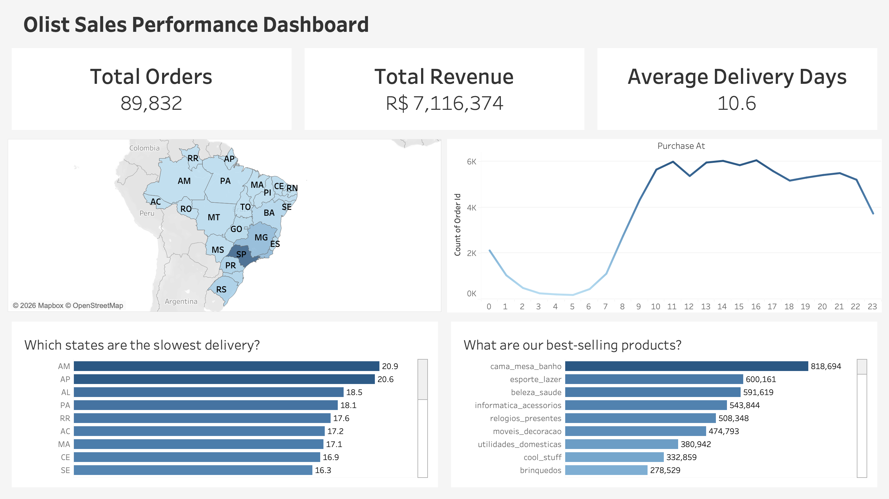

# olist-data-analysis
Analyze customer behavior and the performance of the operations department.

# 🛍️ End-to-End Olist E-commerce Analytics & Delivery Prediction

 
*Check out the [Interactive Tableau Dashboard](https://public.tableau.com/views/OlistE-CommerceSalesDeliveryPerformance/OlistDashboard?:language=en-GB&:sid=&:redirect=auth&:display_count=n&:origin=viz_share_link)*

## 🎯 Project Overview
This project presents a comprehensive analysis of the **Olist E-commerce dataset** (Brazilian marketplace). The goal is to uncover sales drivers, identify operational bottlenecks, and build a predictive model for delivery times. 

The workflow spans the entire data lifecycle:
- **SQL (BigQuery):** Data extraction and relational table joining.
- **Python (Pandas, Seaborn):** Data cleaning, Outlier management, and EDA.
- **Tableau:** Business Intelligence & Interactive Dashboarding.
- **Machine Learning (Scikit-Learn):** Predictive modeling for logistics optimization.

---

## 📊 Data Source & Schema
The analysis is based on the **Brazilian E-Commerce Public Dataset by Olist**, the largest department store in Brazilian marketplaces.
* **Source:** [Kaggle - Olist Dataset](https://www.kaggle.com/datasets/olistbr/brazilian-ecommerce)
* **Dataset Period:** 2016 to 2018
* **Data Context:** This is real commercial data that has been anonymized. It includes 100k orders with features such as order status, price, payment, freight performance, customer location, and product attributes.

### Data Relational Map
The dataset consists of 9 relational tables. Understanding the primary keys (e.g., `order_id`, `customer_id`) is crucial for joining the tables correctly in BigQuery/Python.

---

## 💡 Key Business Insights

### 1. Revenue & Market Demand
- **Performance:** Successfully processed **~89.8K orders**, generating **R$ 7.11M** in total revenue.
- **Winning Categories:** *Cama, Mesa & Banho* (Bed, Bath & Table) and *Esporte & Lazer* (Sports & Leisure) are the top revenue contributors, suggesting high demand in home and lifestyle segments.

### 2. Consumer Behavior & Purchase Timing
- **The Peak Window:** Ordering activity peaks significantly between **10:00 AM and 4:00 PM**. 
- **Opportunity:** This "mid-day shopping trend" identifies the prime window for targeted marketing campaigns and flash sales to maximize ROI.

### 3. Logistics & Regional Disparities
- **Average Delivery:** 10.6 days.
- **The Bottleneck:** Severe regional disparities exist. Northern states like **AM (Amazonas)** and **AP (Amapá)** suffer from lead times exceeding **20+ days**, whereas the Southeast (SP) remains highly efficient.

---

## 🛠️ Technical Deep Dive

### Data Integrity & Outlier Management
To ensure statistical reliability, I applied the **Interquartile Range (IQR)** method to handle delivery anomalies:
$$IQR = Q3 - Q1$$
- By isolating extreme cases (some exceeding 200+ days), I ensured that the findings represent the **true customer experience** without being skewed by data noise.

### Predictive Analytics: Delivery Time Modeling
Built a model to predict delivery days using features like *price, freight_value,* and *customer_state*.

| Model | Status | Key Observation |
| :--- | :--- | :--- |
| **Linear Regression** | Baseline | Captured general trends. |
| **Random Forest** | Tuned | Initially overfitted; resolved via hyperparameter tuning. |

**Honest Evaluation ($R^2 \approx 0.27$):** This result reveals a crucial business insight: *Financial metrics alone are insufficient to explain delays.* This suggests that logistics efficiency is driven more by infrastructure and distance than by order value.

---

## 🚀 Strategic Recommendations

1. **Marketing Optimization:** Align advertising spend with the **10:00 - 16:00 peak** to improve Conversion Rate (CVR).
2. **Logistics Overhaul:** Explore local **micro-fulfillment centers** in the Northern/Northeast regions to bridge the 20-day delivery gap.
3. **Phase 2 - Spatial Engineering:** The next iteration will include **Geolocation Data (Lat/Long)** to calculate precise "Seller-Buyer Distance," aiming to significantly improve model accuracy.

---

## 📁 Repository Structure
- `/sql`: BigQuery scripts for data extraction.
- `/notebooks`: Python files for EDA and Machine Learning.
- `/tableau`: Tableau Workbook (.twbx).
- `/images`: Screenshots and Visualizations.
